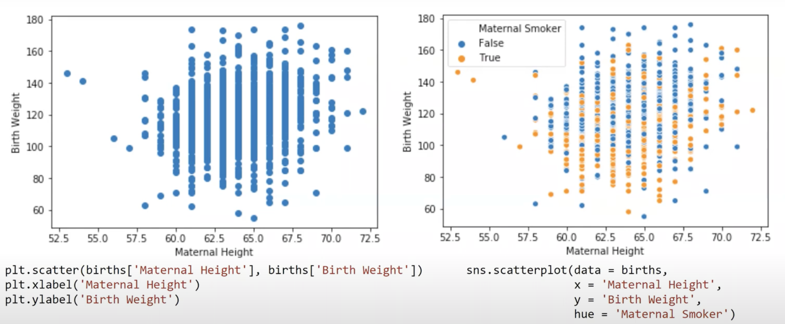

[toc]

---

## Lecture 7, 02/8/22 (Wk4): Data Visualizations

### Resources

- [Lecture 7 Slides: Plotting for Distributions](https://docs.google.com/presentation/d/16I18f4NlOdODeQ20e4YQVwDJ_869MHKKklWeMmYK8IQ/edit#slide=id.g11326e8245b_0_326) – *note that the lecture slides contain comprehensive explanations whereas these notes serve as a quick summary of thoses same slides*

### Goals of Data Visualization

- **Goal 1:** To help your own understanding of your data/results
- **Goal 2:** To communicate results/conclusions to prove

### Distributions

A **distribution** describes the frequency at which values of a variable occur:

- Every value is accounted for **only once**
- All values add up to 100%

### Describing Distributions

**Skweness** (somewhat counterintuitive)
- **Skewed right**: long right tail
- **Skewed left**: long left tail
- **Symmetric**: tails are of equal size

**Outliers**
- What qualifies as an "outlier"? Defining outliers is a judgement call (we'll come back to this later)

**Mode**
- Local or a global maximum
- **Unimodal**: single clear maximum
- **Bimodal**: two modes
- Note that we need to distinguish between modes and **random noise**; we can use a **Kernel Density Estimate** to do this

#### Bar Plot

- Most comon way of displaying the distribution of a **qyalitative (categorical) variable**
- The lengths of the bars encode *values*, while widths encode *nothing*


#### Rugplot


#### Box Plot


- `sns.boxplot(y = 'Birth Weight', data = births)`


#### Histogram

Note that the y-axis label is **density** (percent per unit), not *count*!


#### Violin Plot


#### Scatter Plot





#### Hex Plot


#### Contour Plot


---

<br><br>

## Lecture 8, 02/10/22 (Wk4): Data Visualizations II

**Topics Covered in the [Slides](https://docs.google.com/presentation/d/1W5PoZ-SwxjpFMrCblOHDqutCP7v4RGNf2s8rnz6d8ak/edit#slide=id.g11391ee6e2e_0_18):**

- Kernel density estimates (KDEs)
- Kernels (Gaussian, boxcar, etc.)
- Overview of:
  - Information channels
  - X/Y axes
  - Color
  - Markings
  - Conditioning
  - Context
  
### Kernel Density Estimation (KDE)

Kernel Density Estimation is used to estimate a **probability density function** (or **density curve**) from a set of data.
  - Just like a histogram, a **density curve**'s total area must sum to 1

### Creating KDEs

- Place a **kernel** at each data point
- Normalize **kernals** so that total area = 1
- Sum all **kernels** together

Wait, but what's a kernel? A **kernel** is just a valid density function, meaning that it:

- Must be non-negative for all inputs
- Must integrate to 1

>3 steps:
>
>
>
>
>
>
>
>- `sns.distplot()`

### Summary of KDE

*A general KDE function from the slides is given below:*


**Notation:**

- $x$ -> any integer; input to our function

- $n$ -> number of observed data points

- $x_i$ -> arbitrary observed datapoint from 1 to n; used to create KDE

- $\alpha$ -> bandwidth or soothing parameter

- $K_\alpha (x, x_i)$ -> kernel centered on the observation *i*
  - Each kernel individually has area 1. We multiply 1/n so that the total area is still 1.

- 其中 
    $$
    K_\alpha(x,x_i) = \frac{1}{\sqrt{2\pi}\alpha} e^{-\frac{(x-x_1)^2}{2\alpha^2}}
    $$


### Other Kernels


---

<br><br>

## Lecture 9, 02/15/22 (Wk5): Modeling and Simple Linear Regression

### Regression Line & Correlation

The **regression line** is the unique straight line that minimizes the **mean squared error** of estimation among all straight lines.

**Correlation (r)** is the average of the product of `x` and `y` both measured in standard units.

- :
    ```python
    # r is the correlation coefficient
        slope = r * ((SD of y) / (SD of x))
    
        intercept = mean(y) - slope * mean(x)
    
        residual = observed value - regression estimate
    ```


### Parametric Models of Regression

A **model** is an idealized representation of a system. We build models to understand *complex phenomena* occuring in the world we live in and *make accurate predicitons* about unseen data.

The **Simple Linear Regression** Model (SLR) is a parametric model, meaning that we choose the "best" parameters for slope and intercept based on data.

### The Modeling Process
> 
> - See [Lecture 09: Slide 25](https://docs.google.com/presentation/d/1SnfnL2A0EvSyEYXG_15YYUnP1u-xISkNrholjdaQKbg/edit#slide=id.g1150ea2fb2b_0_3035)
> 1) **Choose a model**
>    1) How should we represent the world?
> 2) **Choose a loss funciton**
>    1) How do we quantify predictione error?
> 3) **Fit the model**
>    1) How do we choose the best parameters of our model given our data?
> 4) **Evaluate model performance**
>    1) How do we evaluate whether this process gave rise to a good model?

### Loss Functions

**Loss functions** characterize the cost, error, or *fit* resulting from a particular choice of model or model parameters

- Loss quantifies how bad a prediction is for a *single* observation
- If our prediction is close to an actual value, we want *low loss*
- If our prediction is far from an actual walue, we want *high loss

Some common loss functions are:
- Squared loss (L2 loss): $(y - \hat{y})^2$
- Absolute loss (L1 loss): $|y - \hat{y}|$
- Average loss (empirical risk)

### Minimizing MSE for the SLR Model


- See [Lecture 09: Slide 41](https://docs.google.com/presentation/d/1SnfnL2A0EvSyEYXG_15YYUnP1u-xISkNrholjdaQKbg/edit#slide=id.g1150ea2fb2b_0_132)

The **objective function** is the function to minimize (find the values of `a` and `b` that minimize the average squared loss (MSE) for the SLR model):

### Evaluating Models

To determine if our mdoel was a good fit to our data, we need to:

1) Visualize data and compute statistics
2) Calculate performance metrics
3) Look at the residual plot to visualize the difference between actual and predicted `y` values

---

<br><br>

## Lecture 10, 02/17/22 (Wk5): Constant Model, Loss, Transformations

### Resources
- See the [Lecture 10 Slides](https://docs.google.com/presentation/d/1tCdhfvPOe7R4T7V9L9VjR_KtJG39UapZuNfNWITMK3Q/edit#slide=id.g10ed28599e7_0_0) for more content.
  - The notes for this lecture serve as an overview of content, but lack key formulas and computation given the restrictions of LaTeX rendering in markdown on GitHub.
- See the [Regression HW](https://drive.google.com/file/d/11E87V-ude_uwChqNPxAbLPj62are7iYl/view) from Data 100, Fall 2021. It's likely that the homework released tomorrow (02/18/22) will look very similar.

### Terminology & Notation


### Minimizing MSE

Minimizing MSE is really just minimizing squared residuals!

### Terminology: Prediction vs. Estimation

**Esimation** is the task of using data to determine model parameters

**Prediction** is the task of using a model to predict outputs for unseen data

**Least Squares Estimation** is when we choose the parameters that minimize MSE

### The Constant Model

The **summary statistic** summarizes the sample data by always "predicting" the same number – i.e. predicting a constant. It ignores any relationships between variables. In other words, the constant model is a parametric, statistical model.
$$
\hat{y} = \theta
$$

### Fit the Model: Calculus for the General Case

The derivative of the sum is the sum of derivatives (useful for differentiating with respect to theta)

### Summary: Loss Optimization, Calculus, & Critical Points

**Step 1:** define the *objective function* as average loss

**Step 2:** Find the *minimum* of the objective function

Recall *critical points*! On the homework, we'll prove that MSE has a property of convexity that guarantees that R(theta_hat) is a global minimum


### Anscombe's quartet

*From [Wikipedia](https://en.wikipedia.org/wiki/Anscombe%27s_quartet)*

### Multiple Linear Regression


#### Linear Algebra Representation


---

<br><br>

## Midterm 1 Review Session, 02/19/22 (Wk5):

- [MT1 Review Session Slides](https://docs.google.com/presentation/d/1Bblt8Dr_nr7G6aSvkUvR6knbjGmYzSJV7kzJVTNdIVs/edit)

### Sampling

Sampling is particularly useful for inferring observations about the population by using only a subset of individuals from that population.

#### Simple Random Sample

- Drawn uniformly, meaning every individual has the same probability of being selected
- Without replacement, meaning an individual can never be selected twice

#### Simple Random Sample w/ Replacement

- Drawn uniformly
- With replacement, meaning individuals can be selected more than once

#### Stratified Random Sample

- Break up population into multiple groups of interest
- Take simple random samples from within each group

#### Quota Sampling

- Define various subgroups of the population and then reach those groups however you can

#### Convenience Sampling

- Sample whoever you can get ahold of
- Extremely prone to bias

#### Selection Bias

- Bias that arises when selecting individuals

#### Response Bias

- Bias that arises when people don't respond truthfully

#### Non-response Bias

- Bias that arises when people don't respond

#### Census

- A census is an official count or survey of a population

### Probability

[Binomial and Multinomial Probabilities](#binomial-and-multinomial-probabilities)

### Types of Variables

#### Quantitative

- **Discrete** - can only take on specific numerical values
  - number of students
- **Continuous** - could take on any value in an interval
  - Ex: price, temperature


#### Qualitative

- **Ordinal** - implicit ordering
  - Yelp stars
- **Nominal** - no possible ordering
  - Eye color

### Loss Functions & Linear Regression

#### L1 Loss (Mean Absolute Loss) [MAS]


- Optimal parameter is median
- Not smooth, not differentiable everywhere
- Robust to outliers

#### L2 Loss (Mean Squared Loss) [MSE]


- Smooth, differentiable
- Sensitive to outliers
- Optimal parameter is mean

---

<br><br>

## Lecture 11, 02/22/22 (Wk6): Ordinary Least Squares (Multiple Linear Regression)

### Associated Readings

- This lecture will be particularly useful for Questions 2 and 4 on [Homework 5, Linear Regression](https://ds100.org/sp22/hw/hw05/hw05_student.pdf)

- Current Slides & Code: [Lecture 11 from Data 100, Spring 2022](https://ds100.org/sp22/lecture/lec11/)
  - The notes for this lecture serve as an overview of content, but lack key formulas and computation given the restrictions of LaTeX rendering in markdown on GitHub.

- Check out [Lecture 13 from Data 100, Fall 2020](https://docs.google.com/presentation/d/15olJS1Yuk22spzrNx4It6-eLm8gkZM4pFKKOWhKXBUI/edit#slide=id.p)


### Content Overview 

In this lecture, we use linear algebra to generalize the simple linear regresison model

- Use **vector dot products** to define the multiple regression model
- Formulate the problem statement using **vector norms**
- Use a **geometric derivation** to solve for the optimal **theta** (which is now a vector!)
- Explore **properties of residuals**
- Find situations where **unique solutions** exist

### Recap: Simple vs. Multiple Linear Regression

In *simple linear regression*, we solved for **optimal parameters**, we minimize MSE by hand using calculus. 

In *multiple linear regression*, we did not minimize RMSE by hand using calculus–we abstracted away the process.


### py

- `df.to_numpy()`


### Performance (Residuals, Multiple $R^2$)


### OLS Properties

- the sum of the residuals is zeros
    $$
    \sum_{i = 1}^n e_i = 0
    $$

- unique

    

    

    

---


