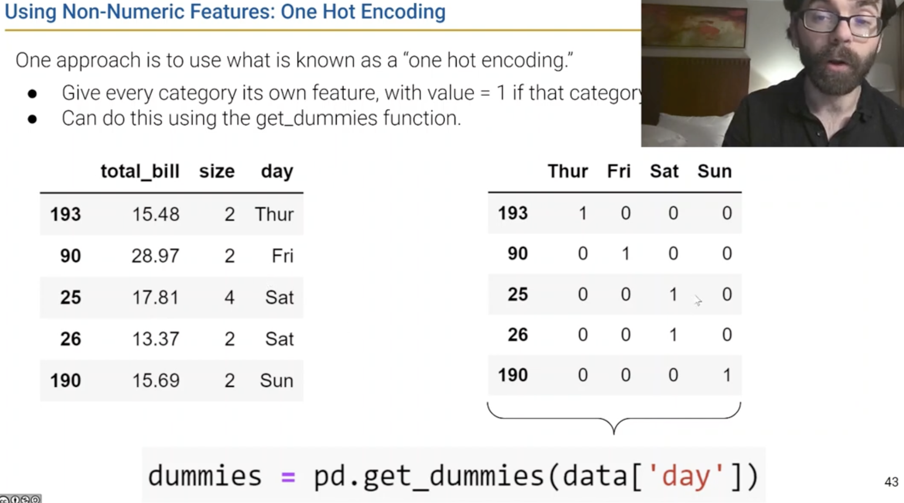
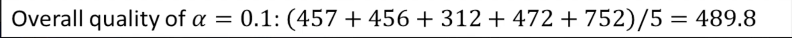
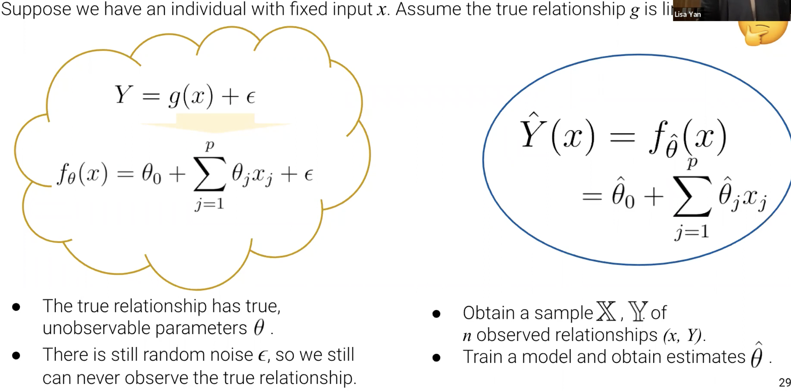
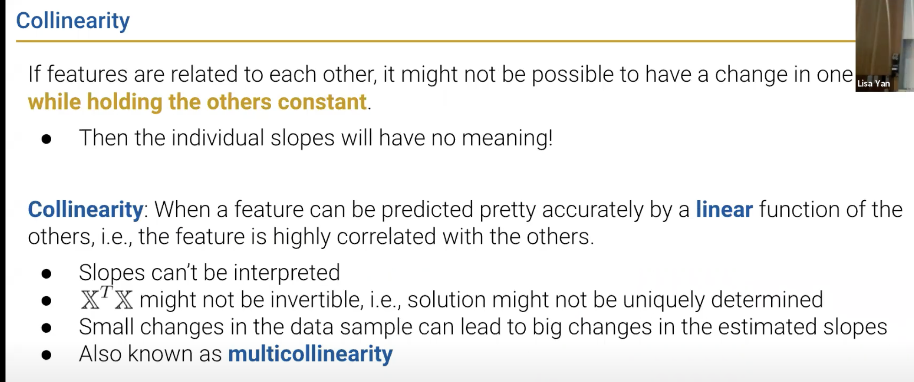

[toc]

---

<br><br>

## Lecture 12, 03/01/22 (Wk7): Gradient Descent, sklearn

*Note:* today’s lecture is largely in a [Jupyter notebook](https://data100.datahub.berkeley.edu/hub/spawn-pending/willtholke?next=%2Fuser%2Fwilltholke%2Fgit-pull%3Frepo%3Dhttps%253A%252F%252Fgithub.com%252FDS-100%252Fsp22%26urlpath%3Dlab%252Ftree%252Fsp22%252Flec%252Flec12%252Flec12.ipynb%26branch%3Dmain)!

### Abstraction and Simplicity

Instead of computing the MSE nanually, there is a function in the `sklearn` package that we can use to compute the MSE from a list of observations and predictions.

- :
    ```python
    from sklearn.linear_model import LinearRegression
    model = LinearRegression()
    model.fit(df[["total_bill"]], df["tip"])
    df["sklearn_predictions"] = model.predict(df[["total_bill"]])
    ```

When we're making predictions, all predictions lie on a plane in $R^3$ or in a hyperplane in $R^n$ where $n > 3$.

### Minimization

All the fancy machine learning algorithms we've learned so far (for example, not something we covered so far, an AI that's trying to figure out whether a picture is of a dog or a cat) are just trying to find **parameters that minimize some function**. We can minimize a mathematical function by using the `scripy.optimize.minimize` function.

- :
    ```python
    from scripy.optimize import minimize
    minimize(arbitrary, x0 = 6)
    ```

### Gradient Descent

**Gradient descent** allows us to find the minima of functions
- at each step, we compute the steepest direction of the function we’re minimizing, yielding a p-dimensional vector.
- our next guess for the optimal solution is our current solution minus this p-dimensional vector times a learning rate alpha.
- for convex functions, the minimum that gradient descent finds is guaranteed to be a global minimum.
  - optimization procedures on convex functions tend to converge much more quickly than on non-convex functions (even those with a single minima).
- stochastic gradient descent lets us to rapidly compute an approximation of the gradient. 
- can be done in batches of data, or even on a single data point.


**Gradient descent** as a recurrence relation: in code!

- :
    ```python
    def gradient_descent(df, initial_guess, alpha, n):
        """ Perform n steps of gradient descent on df using learning rate 
        alpha starting from initial_guess. returns a numpy array of all
        guesses over time.
        """
        guesses = [initial_guess]
        current_guess = initial_guess
        while len(guesses) < n:
            current_guess = current_guess - alpha * df(current_guess)
            guesses.append(current_guess)
        return np.array(guesses)
    ```

---

<br><br>

## Lecture 13, 03/03/22 (Wk7): Feature Engineering

### Batch Gradient Descent

**Batch Gradient Descent** uses the entire batch of available data to compute the gradient. However, *the amount of computation grows linearly with the amount of data*. For this reason, we sometimes use **Mini-Batch Gradient Descent**:

- Compute the first gradient on the first 10% (arbitrary choice; a typical choice is 32) of the data. Adjust parameters.
- Then compute the first gradient on the next 10% of the data. Adjust parameters.
- ...
- Then compute the gradient on the last 10% of the data. Adjust parameters.
- Repeat the process above until we either hit some max number of iterations or our error is below some desired threshold

Each set of **passes** of the data is known as a **training epoch**, which is a term frequently used in the context of machine learning.

For example, if we choose to compute the gradients on 32 data points at a time, we then compute $\frac{n}{32}$ passes for each epoch.

**Stochastic Gradient Descent** is just mini-descent where the batch size is 1; the gradient is computed using only a single data point. Note that we won't prove or implement this in this course.


### Convexity

If a function is **convex**, then the gradient descent is guaranteed to find a global minimum.

*MSE loss is convex*, so gradient descent is always going to be able to minimize the MSE (find the global minimum)

Note that convexity can be represented as a mathematical formula

### Feature Engineering

**Feature Engineering** is the process of *transforming* the raw features *into more informative features* that can be used in modeling or EDA tasks

Feature engineering is extremely useful! We can:
- Capture *domain knowledge* (relationships between features)
- Express *non-linear relationships* using *simple linear models*
- *Encode non-numeric features* to be used as inputs to models

A **feature function** takes our original **d dimensional input** and transforms it into a **p dimensional input**

Note that adding a squared feature allows us to capture a parabolic relationship with a linear model.





### Error Complexity / Variance


### Overfitting


### Modeling Non-linear Relationships

[14.3 - Modeling Non-linear Relationships - Data100, Spring 2021](https://www.youtube.com/watch?v=nsq8udfBGGY&list=PLQCcNQgUcDfqQOBZbRKTy4mwEtykpa9O9&index=6)


### One Hot Encoding

See the [lecture slides](https://ds100.org/sp22/lecture/lec13/).

### Lecture 14

Lecture 14 – Case Study (HCE): Fairness in Housing Appraisal

---

<br><br>

## Lecture 14, 03/08/22 (Wk8): Case Study (HCE): Fairness in Housing Appraisal

This lecture is [pre-recorded](https://ds100.org/sp22/lecture/lec14/) from another semester and is essential for the project but not for midterm 2 or the final.

---

<br><br>

## Lecture 15, 03/10/22 (Wk8): Cross Validation, Regularization

### Associated Lecture Slides

- [DS100 Sp22 Lec 15](https://docs.google.com/presentation/d/1-Cga_fOn0dTMt1ss7vNmManX-NUYPXwXDQDAsaInuQM/edit#slide=id.g1140e73d20a_1_0)

### Review

**As we increase the complexity of our model:**

- Training error decreases
- Variance increases

### The Holdout Method

We can avoid overfitting using the **holdout method**, in which we keep some of our data secret from ourselves. 
- We train out models on some percentage of the available data points
- We evaluate the model's performance on the remaining 10 data points
  - Data used to train is called the **training set**
  - Held out data is often called the "validation set" or "development set" or "dev set"


#### Splitting Data with sklearn

Assume that there is a table `vehicle_data_sample_35` with 35 rows

- :
    ```python
    from sklearn.utils import shuffle
    training_set, dev_set = np.split(shuffle(vehicle_data_sample_35), [25])
    ```

Notice that we shuffle the data; we do this because the data is **contiguous**. We want the data points to be *unordered*

As a reminder, higher model order $\implies$ less error. That is,
- **training error** decreases
- **variance** increases
- **error on test data** decreases, then increases 

We want to pick the model complexity that *minimizes validation set error*.

*Visual explanation: the dotted line is the chosen complexity level*


#### Hyperparameters

In machine learning, a **hyperparameter** is a value that controls the learning process itself:

- For instance, we may have a model which has a hyperparameter called "degree" or $k$ that controlled the order of our polynomial

### K-Fold Cross Validation

**Quality** is the model's error on only the testing set (validation set). We choose the value of a hyperparameter $\alpha$ by choosing the value associated with the lowest MSE

Chunks of data are commonly referred to as a "fold"

With **k-fold cross validation**, we split our data into $k$ equally sized groups (folds)
- Pick a fold (testing/validation fold)
- Train model on all but this fold
- Compute the error on the validation fold
  - **Repeat the above for all $k$**
- Calculate the quality as the **average of the $k$ validation fold errors**





### Methods in sklearn


Assume that...
- The hyperparameters to try are stored in the dict `parameters_to_try`
- The loss function is given by `scoring`
- The number of folds is given by `cv`

#### K-Fold Cross Validation in sklearn

- :
    ```python
    model_finder = GridSearchCV(estimator = scaled_ridge_model,
            param_grid = parameters_to_try,
            scoring = "neg_mean_squared_error",
            cv = 5)
    ```

#### The Holdout Method in sklearn

- :
    ```python
    model_finder = GridSearchCV(estimator = scaled_ridge_model,
            param_grid = parameters_to_try,
            scoring = "neg_mean_squared_error",
            cv = [[training_indices, dev_indices]])
    
    ```

### Test Sets

We defined **training set**, **validation (dev) set**, and **test set**. However, what's different between the test set and the other sets is that it is used to *provide an unbiased MSE at the end*.

We can generate **test sets** ourselves or take them from a common data set whose solution is unknown.

### Ridge Regression

See the [Associated Lecture Slides](#associated-lecture-slides)


- smaller radius -> less complex model
- （半径很小的时候几乎为 constant model）

### L2 Regularization


- The weigh of the regularizationn term, $\alpha$, is inversely proportional complexity

### L2 Regularized in sklearn


- 当 $\alpha$ 很小时，其接近 OLS.


### Scaling Data for Regularization


### L1 Regularization


summary


---

<br><br>

## Lecture 16, 03/15/22 (Wk8): Random Variables

### Associated Lecture Slides

- [DS100 Sp22 Lec 16](https://docs.google.com/presentation/d/1M2B4JPUO734RqmjCAlZL4iIem-PFVXMeiynp4fxoVFU/edit#slide=id.g10ed28599e7_0_0)

### Overview

We need to know just enough probability to help understand its implications for modeling0

- The **sample mean** is the mean of our random sample
- The **Central Limit Theorem** states the following: if you draw a large random sample with replacement, then, regardless of the population distribution, the probability distribution of the sample mean:
  - Is roughly normal
  - Is centered at the population mean
  - Has a standard deviation of `population SD / sqrt(sample size)`
- Probabilities are areas of histograms

### Random Variable

A **random variable** is a numerical function of a sample, often denoted with uppercase "variable-like" letters such as `X` and `Y`
- Also called "sample statistic" or "statistic"
- Domain (input): all random samples of size `n`
- Range (output): number line

### Common Random Variables

**Bernoulli(p)**
- Value 1 with probability p, 0 with probability 1 - p
- "Indicator" random variable

**Binomial(n, p)**
- Number of 1s in n independent *Bernoulli(p)* trials
- Probabilities given by the binomial formula

**Uniform on a finite set of values**
- Probability of each value is 1 / (size of set)
- For example, a standard die

**Uniform on the unit interval(0, 1)**
- Density is flat on (0, 1) and 0 elsewhere

**Normal**

### Expectation and Variance

The **expectation** of a random variable `X` is the weighted average of the values of `X` where the weights are the probabilities of the values


The **variance** is the expected squared deviation from the expectation of `X`

See [Slide 26](https://docs.google.com/presentation/d/1M2B4JPUO734RqmjCAlZL4iIem-PFVXMeiynp4fxoVFU/edit#slide=id.g11d4f5ec14d_0_396) for an example

### Sums of Random Variables

A function of a random variable is also a random variable. That is, creating multiple random variables based on your sample means that functions of those random variables are also random variables

Two random variables `X` and `Y` are **equally distributed** if:
- `X(s) = Y(s)` for every sample `s`
- `X = Y`

They are **identically distributed** if:
- The dist of `X` is the same as the dist of `Y`

They are **independent and identically distributed (IID)** if:
- `X` and `Y` are identically distributed
- Knowing the outcome of `X` does not influence your belief of the outcome of `Y` and vice versa ("`X` and `Y` are independent)

**Covariance** is the expected product of deviations from expectation. Correlation (and therefore covariance) measures a linear relationship between X and Y.


### Properties of Bernoulli Random Variables

See [Slide 44](https://docs.google.com/presentation/d/1M2B4JPUO734RqmjCAlZL4iIem-PFVXMeiynp4fxoVFU/edit#slide=id.g1192016999a_0_1074) for an explanation

### Sample Statistics

If we know the distribution of a random variable, we can reliably compute expectation, variance, functions of the random variable, etc.

However, in data science, we often collect **samples**:
- We don't know the distribution of our population
- We'd like to use the distribution of the sample to estimate/infer properties of the population

That is, in data science, we want to make a **big assumption**: we sample at random with replacement from the population to get our sample size `n`

The **sample mean** is normally distributed by the Central Limit Theorem

### Central Limit Theorem

No matter the population we are drawing from, if an IID sample of size `n` is large, the probability distribution of the **sample mean** is **roughly normal**!

How large does `n` have to be? If the population is roughly symmetric and unimodal/uniform, we might need only as few as `n = 20`! If the population is skewed, we'll need a bigger `n`. If in doubt, we can bootstrap the sample mean and see if the bootstrapped distribution is bell-shaped.

---

<br><br>

## Lecture 17, 03/17/22 (Wk9): Estimators, Bias, and Variance

### Associated Lecture Resources

- [Slides, code, code HTML, derivation HTML, recording](https://ds100.org/sp22/lecture/lec17/)

### Square Root Law

**Square Root Law** - if you increase the sample size by some factor $k$, the SD decreases by $\sqrt{k}$.

### Prediction vs. Inference

We build models to...
1. Make accurate *predictions* about unseen data
   - We **predict** by using our model to make predictions for the response (output) of unseen data
2. Understand *complex and real-world phenomena* 
   - We **infer** by using our model to draw conclusions about the relationship(s) between our features and response




### Model Risk


### The Bias-Variance Tradeoff

See [slides 31 through 47](https://docs.google.com/presentation/d/1gzgxGO_nbCDajYs7qIpjzjQfJqKadliBOat7Es10Ll8/edit#slide=id.g11df3da7bd7_0_423) for a detailed overview.


For a detailed overview of unbiased estimators, check out [this section in the stat88 textbook](http://stat88.org/textbook/notebooks/Chapter_05/04_Unbiased_Estimators.html).

### The Snowy Plover dataset [Important for HW 6]

See the [Jupyter Notebook HTML render](https://ds100.org/sp22/resources/assets/lectures/lec17/lec17.html).

### Review: Bootstrapping

See [the "Bootstrapping!" section](https://github.com/willtholke/Data8/blob/main/notes/lec-notes.md#bootstrapping) from my Data 8 notes.

### Collinear




