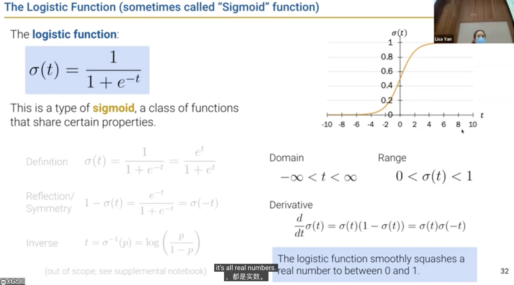

[toc]

---

<br><br>

## Lecture 21 Classification and Logistic Regression

### Deriving the Logistic Regression Model


### The Logistic Regression Model

#### Sigmoid Function



#### From Feature to Probability


#### Parameter Interppretation


### Parameter Estimation


---

<br><br>

## Lecture 22 Logistic Regression II

### The Modeling Process

1) Choose a model
   - $\hat{y} = f_\theta(x) = x^T\theta$
2) Choose a loss function
   - Squares Loss or Absolute Loss
3) Fit the model
   - Regularization, Sklearn/Gradient descent
4) Evaluate model performance
   - $R^2$, Residuals, etc.


### Logistic Regression Model

```python
form sklearn.linear_model import LogisticRegression
model = LogisticRegression(fit_intercept=True)
model.fit(X, Y)
```

- optimal parameters:

    ```python
    model.intercept_, model.coef_
    ```

- predict the probabilities under the model:

    ```python
    model.predict_proba([[20]])		# 返回概率
    model.predict([[20]])           # 返回 1 或 0 (概率大于 0.5 则为 1)
    ```

- `.classes_` stores calss labels.


### Linear separability and Regularization


### Performance metrics


#### Precision and Recall


- **Precision** (also called positive predictive value) is the fraction of true positives among the total number of data points predicted as positive. (TP / predicted_P)h
- **Recall** (also known as sensitivity) is the fraction of true positives among the total number of data points with positive labels. (TP / total_P) 

$$
\text{Precision} = \frac{n_\text{true\_positives}}{n_\text{true\_positives} + n_\text{false\_positives}}
$$

$$
\text{Recall} = \frac{n_\text{true\_positives}}{n_\text{true\_positives} + n_\text{false\_negatives}}
$$

### Adjusting the Classification Threshold


---

<br><br>
