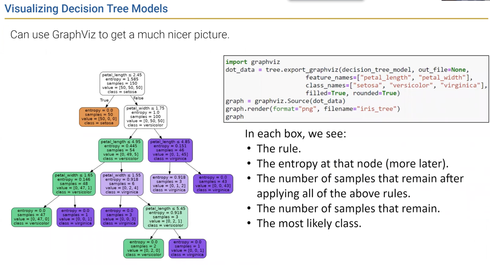

[toc]

---

  

## Lecture 23, 04/19/22 (Wk13): Decision Trees

### Multiclass Classification

### Context: Why decision trees? What about overfitting? Random forests?

#### The Decision Tree Generation Algorithm

**Decision Trees** - alternate way to classify data; tree of questions that must be answered in a sequence to get a predicted classification. Offers a non-linear framework for classification and regression.

*Advantages:*

- Able to capture non-linear relationships
- Output is interpretable (traceable on the tree)
- Regression is straightforward

*Disadvantages:*

- High danger of overfitting (model fits exactly against its training data)
- Complex decision boundaries
- Mathematically unkind

*How decision trees are created*:

- data starts in root node
- until every node is either **pure** or **unsplittable**, 
    1) pick the best feature $x$ and best split value
    2) split the data into two nodes

**Pure Node** - has only samples from one class

**Unsplittable Node** - has overlapping data points from different classes; cannot be split

**Node Entropy** - measure of disorder/unpredictabiility in a node; low entropy $\implies$ more predictable, high entropy $\implies$ less predictable

**Random Forest** - simple idea of generating multiple decision trees on one dataset and then voting on some point $(x, y)$

*How do we generate random forests?*
- Generate bootstrap resamples of training data
- Fit one model for each resample
- Final model = average predictions of each small model

### Math & Computation

#### Node Entropy

$$ S = -\sum_{C} p_C \log_{2} p_C $$

$p_C$ - proportion of data points in a node with label $C$

This function is a measure of the unpredictability of a node in a decision tree. It can be used to determine the quality of a split.

#### Weighted Node Entropy

$$ L = \frac{N_1 S(X) + N_2 S(Y)}{N_1 + N_2} $$

$N_1$ - number of samples in the left node $X$
$N_2$ - number of samples in the right node $Y$

This notion of a weighted average can be extended to other metrics such as Gini impurity and variance simply by changing the $S$ (entropy) function to $G$ (Gini impurity) or $\sigma^2$ (variance)

#### Gini Impurity

$$ G = 1 - \sum_{C} {p_C}^2 $$

$p_C$ - proportion of data points in a node with label $C$

The Gini impurity of a node is another metric for determining the quality of a split.

#### Variance

$$ \sigma^2 = \frac{1}{N} \sum_{i=1}^{N} (x_i - \mu)^2 $$

$\mu$ - mean
$N$ - total number of data points
$x_i$ - the value of each data point

The variance is the chance that a sample would be misclassified if randomly assigned at this point. Gini impurity is a popular alternative to entropy for determining the best split at a node, and it is in fact the default criterion for scikit-learn's `DecisionTreeClassifier`.

### Avoid Overfitting

*Prevent overfitting by:*

- deterministically limiting the depth of a tree
- pruning irrelevant branches
- using random forests

- If replacing a node by its most common prediction has no impact on the validation error, then dont split that node.

### Other Useful Notes

When creating a decision tree for classification, we might end up having a terminal node that has more than one class if **we limit the maximum depth of the decision tree**.

Suppose that one terminal decision tree node contains 22 **A** values and 12 **B** values. We want to *make a prediction* and our sequence of yes/no questions leads us to this node. Instead of giving a probability of **A**, refusing to make a prediction, or doing something else, we **predict that the class is A**.

The advantage of generating and sampling from a random forest over a decision tree is that there is *lower variability*; keep in mind that, due to the bias-variance tradeoff, there's higher bias.

---

  

## Lecture 24, 04/21/22 (Wk13): Clustering

**Clustering** - algorithms used in unsupervised learning to identify patterns in unlabaled data; clustering does so *automatically*

*Approaches to Clustering*:
- **K-means** - optimize a loss function called inertia; most popular approach
- **Agglomerative** - hierarchical clustering

### K-means Algorithm

- Pick an arbitrary $k$, and randomly place $k$ "centers," each a different color
- Repeat until convergence:
  - Color points according to the closest center
  - Move center for each color to center of points with that color

    ...

> 注意 k-Nearest Neighboohrs 是一个 Classification 算法

### Loss Functions for Clustering

Every time K-means is run, there is a different output (depending on where the centers started). We need loss functions to minimize inertia.

*Loss functions for clustering*:

- **Inertia** - Sum of squared distances from each data point to its center
- **Distortion** - weighted sum of squared distances from each data point to its center

K-means minimizes **inertia** in specific, and often fails to find the global optimum. To this day, there is no known optimal solution to optimizing inertia.

### Agglomerative Clustering Algorithm

- Every data point starts as its own cluster
- Until we only have $K$ clusters left:
  - Join clusters with their closest neighbors

*Note*: select $K$ based on subjective measures

    ...

    ...

    ...

### Hierarchies and Other Concepts

**Agglomerative clustering**, a form of hierarchical clustering, can allow us to visualize a merging hierarchy in a "dendogram"

**Agglomerative clustering** is also used in the assignment of grading bins

### Silhouette Scores (Picking K)

**Silhouette Scores** - used to evaluate how "well clustered" a specific data point is

- **High score:** near the other points in its cluster
- **Low score:** far from the other points in its cluster

*For a data point $X$, the score $S$ is calcualted as:*

- $A$ = average distance to other points in cluster
- $B$ = average distance to points in closest cluster
- $S = (B - A) / \max(A, B)$

*Note*: 

- the highest possible $S$ is 1, which happens when every point in $X$'s cluster is right on top of $X$

    
    
- And $S$ can be negativehh

---

  

## Lecture 25, 04/26/22 (Wk14): Guest Speaker: Amol Deshpande - Data Regulations

N/A

## Lecture 26, 04/28/22 (Wk14): Guest Speaker: Matei Zaharia - Parallel Data Analytics

N/A

*Note*: Final exam on Friday, 05/13/22 @ 7:00pm-10:00pm
